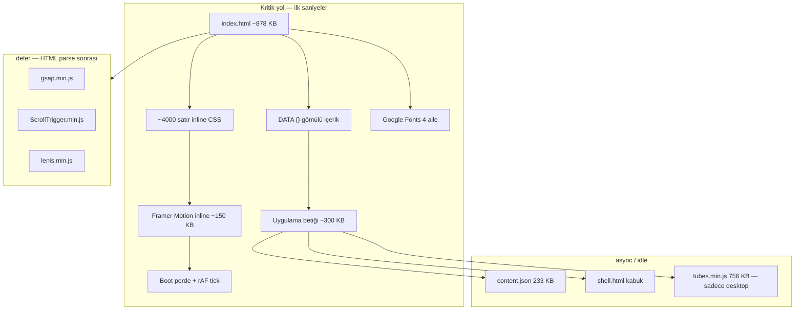

# QANATONE — Performans ve Mimari İnceleme

> **Oturum:** 16 Ağustos 2026  
> **Build:** 130  
> **Konu:** Site geneli yavaşlık, mobil giriş animasyonu kasması, proje kartlarında takılma, mimari hatalar

---

## İçindekiler

1. [Başlangıç talebi](#1-başlangıç-talebi)
2. [Genel mimari harita](#2-genel-mimari-harita)
3. [Giriş animasyonu (boot / splash)](#3-giriş-animasyonu-boot--splash)
4. [Proje kartları (deste)](#4-proje-kartları-deste)
5. [Site geneli geç yüklenme](#5-site-geneli-geç-yüklenme)
6. [Mimari hatalar — öncelik sırası](#6-mimari-hatalar--öncelik-sırası)
7. [Hedef mimari](#7-hedef-mimari)
8. [Teşhis özeti](#8-teşhis-özeti)
9. [Dosya boyutları (ölçülmüş)](#9-dosya-boyutları-ölçülmüş)
10. [Çözüm planı](#10-çözüm-planu)
11. [Kod referansları](#11-kod-referansları)

---

## 1. Başlangıç talebi

Siteyi baştan aşağı parça parça incele; giriş animasyonu, anasayfa kartlar, tüpler, açılış sayfaları. Genel mimari hataları bul.

**Gözlemlenen sorunlar:**

- Mobilde giriş animasyonunda kasma, hatta donma; siteye öyle geçiliyor
- Giriş kısmının altında proje kartları — 2. karttan sonra donuyor ve takılıyor
- Sitenin her tarafı çok geç yükleniyor
- Temelden yanlış bir mimari olup olmadığı şüphesi

**Ortam:** PC (analiz), mobil semptomlar kullanıcı gözlemi.

---

## 2. Genel mimari harita

### 2.1 Akış diyagramı



### 2.2 Katman tablosu

| Katman | Dosya / blok | Boyut | Ne yapıyor |
|--------|--------------|-------|------------|
| Kaynak | `index.html` | 877,8 KB | CSS + JS + içerik + tüm sayfa bölümleri tek DOM |
| Hareket | Inline Framer Motion | ~150 KB satır içi | Boot (masaüstü) + kurucu hover kartı |
| Hareket | `gsap` + `ScrollTrigger` + `lenis` | ~133 KB | Scroll pin/scrub, paralaks, reveal, deste |
| 3D | `tubes.min.js` (dynamic import) | 756,6 KB | Hero WebGL — mobilde kapalı |
| İçerik | `DATA` + `content.json` | gömülü + 232,7 KB | İkili kaynak; fetch sonrası yeniden render |
| Çıktı | `build.js` → `dist/` | 58 statik sayfa | SEO için doğru; kaynak hâlâ monolit |

### 2.3 Mimari gerçek

- Site **tek dosyalık SPA**: içerik JavaScript ile basılıyor.
- `build.js` jsdom ile her rotayı statik HTML'e basıyor — **bot/SEO yolu doğru**.
- Canlı ziyaretçi hâlâ monolit `index.html`'i indirip parse ediyor; prerender yalnızca bot yolunu iyileştiriyor.

### 2.4 İş bölümü (depo sözleşmesi)

- **Claude Code / Cursor:** arka taraf — ajan, build, Netlify, git.
- **claude.ai chat:** ön taraf — sahne, metin, tasarım.
- Ortak beyin: bu depo. Kalıcı kararlar `CLAUDE.md`'ye tek satır.

---

## 3. Giriş animasyonu (boot / splash)

### 3.1 Tasarım niyeti

Perde kapısı **motion kütüphanesinden önce** koşar (2026-08 düzeltmesi):

- Eski sorun: `#boot` display:none iken 36 bin jetonluk Framer Motion parse ediliyordu; ana thread bloke, perde geç doğuyordu.
- Mobilde `.js` sınıfı **eklenmiyor** — hareketin tamamı CSS.
- Kırılma noktası: **900px** (CSS mobil bloğu ile aynı sayı).

### 3.2 Boot akışı (kod)

**Perde kapısı** (`index.html` ~4394–4423):

```javascript
window.__bootMobil = matchMedia('(max-width:900px)').matches;
R.classList.add('boot-on');
R.classList.add('booting');
if (!window.__bootMobil && !matchMedia('(prefers-reduced-motion:reduce)').matches)
  el.classList.add('js');
```

**Mobil CSS zaman çizelgesi** (~0,72 sn'de oturur):

- Harfler: `.06 + 7×.04 = .34` başlangıç + `.38` süre = **0,72 sn**
- Çıkış: harfler `.22 sn`, perde `.5 sn` süpürme

**Boot denetleyicisi:**

- Masaüstü MIN: **2700 ms**
- Mobil MIN: **800 ms**
- Gerçek yükleme sinyalleri: `DOMContentLoaded` → %42, `fonts.ready` → %66, `load` → %100
- rAF tick ile progress bar; `cur >= 1` olunca `finish()`
- Güvenlik: 6 sn booting kaldır, 7 sn perde zorla kapat

### 3.3 Asıl mimari hata — Framer Motion mobilde

Hemen ardından **~150 KB Framer Motion** satır içi, `<head>`'de **senkron parse**:

- Mobilde boot **bunu kullanmıyor** (saf CSS).
- Kullanım yerleri: masaüstü boot animasyonu, kurucu hover kartı (`window.__motion.animate`).
- Mobilde ödenen maliyet: **yüzlerce ms parse, sıfır fayda**.

### 3.4 Boot sonrası çarpışma

Perde kapanır kapanmaz eşzamanlı:

- `renderAll()` — tüm bölümler
- GSAP/Lenis boot döngüsü (66 × 90 ms ≈ 6 sn tavan)
- Yıldız canvas, wordmark, harita sahneleri
- Proje görselleri indirme

**Sonuç:** CSS boot hafif olsa bile JS fırtınası “donup geçiyor” hissi veriyor.

---

## 4. Proje kartları (deste)

### 4.1 Yapı

- `DESTE_PROJE = 4` — ana sayfada 4 kart.
- CSS: `position: sticky`, üst üste binen deste.
- `.dkin`: `transform: scale(var(--s,1))`, masaüstünde `will-change: transform, opacity`, gölge.

### 4.2 Scroll handler — `deck()`

`motion()` içinde (~12356–12383):

```javascript
function deck() {
  const items = $$('#prjDeck .dk');
  const reads = items.map((it, i) => {
    const nx = items[i + 1];
    return nx ? nx.getBoundingClientRect().top : null;
  });
  items.forEach((it, i) => {
    const card = it.querySelector('.dkin');
    const t = top === null ? 0 : Math.min(1, Math.max(0, (H - top) / (H * .82)));
    const sv = 1 - t * .06, ov = 1 - t * .28;
    card.style.transform = 'scale(' + sv.toFixed(4) + ')';
    card.style.opacity = ov.toFixed(3);
  });
}
addEventListener('scroll', () => {
  if (!dRaf) dRaf = requestAnimationFrame(() => { deck(); dRaf = null; });
}, { passive: true });
```

Her kaydırmada: **4× getBoundingClientRect** + **8 style yazımı** → forced layout.

### 4.3 Mobil optimizasyonlar (zaten yapılmış, 2026-08)

- `filter: none` — imgk zaten gri pişmiş
- `backdrop-filter: none` — yıl rozeti
- `will-change: auto`, `box-shadow: none` — rasterleşme maliyeti kalktı
- Hover `:hover` takılması engellendi

**Kalan sorun:** sticky + transform scale + 4 kart aynı anda + layout read.

### 4.4 Görsel bellek — `imgk`

Ölçülmüş (kod yorumu):

| Metrik | Eski | imgk sonrası |
|--------|------|--------------|
| Megapiksel (4 kart) | 8,21 MP | 2,84 MP |
| RGBA bellek | ~33 MB | ~11 MB |

- `imgk`: 960px genişlik, grayscale/contrast tuvalde pişmiş.
- Kart 0–1: `decoding="async"` (hemen).
- Kart 2–3: `loading="lazy"` → **3. karta gelince decode + scroll çarpışması**.

**“2. karttan sonra donma” profili:** lazy decode (index 2,3) + `deck()` layout read + diğer rAF döngüleri.

---

## 5. Site geneli geç yüklenme

### 5.1 İlk indirme bütçesi

```
index.html           877,8 KB
Framer Motion inline ~150 KB (HTML içinde)
content.json         232,7 KB (no-store fetch)
gsap + ST + lenis    ~132,7 KB (defer)
Google Fonts         ~150+ KB (4 aile, çok weight)
─────────────────────────────
Minimum JS/HTML      ~1,2 MB + görseller
tubes.min.js         756,6 KB (desktop, dynamic import)
```

### 5.2 İçerik çift kaynak

```javascript
// boot() sonu
await kabugu_tamamla();
renderAll();                    // gömülü DATA
const r = await fetch('content.json', { cache: 'no-store' });
if (r.ok) applyContent(await r.json());  // yeniden render
```

### 5.3 Eşzamanlı rAF / animasyon motorları

| Döngü | Koşul |
|-------|-------|
| Boot tick | Perde açıkken |
| Stars canvas | `__starsInit`, tema açıksa |
| Wordmark footer | Görünür olunca |
| Harita / sızıntı / kanal | Scroll + kendi rAF |
| `deck()` scroll | Projeler bölümü |
| GSAP ticker + Lenis | Desktop (innerWidth > 880) |
| Three.js tubes | Hero görünürken, desktop |

**Üç animasyon sistemi:** CSS keyframes + Framer Motion + GSAP/Lenis.

### 5.4 Zaten doğru yapılanlar

- Tubes mobilde kapalı (`innerWidth < 900`, `pointer:coarse`)
- Lenis mobilde kurulmuyor
- `ScrollTrigger.config({ ignoreMobileResize: true })`
- `genislikDegisince` — yalnız `innerWidth` değişince resize handler
- `#noise` mobilde kapalı
- `gsap.ticker.lagSmoothing(500, 33)` — lag telafisi düzeltmesi

### 5.5 Kabuk tamamlama

Statik alt sayfadan gezinince `shell.html` fetch + DOM birleştirme + tüm `...Kur()` — ek gecikme.

---

## 6. Mimari hatalar — öncelik sırası

### 🔴 Kritik

1. **Framer Motion mobilde kritik yolda, kullanılmıyor** — ~150 KB parse, sıfır fayda.
2. **Monolit SPA kaynağı** — 878 KB tek HTML; ilk ziyaret = tam uygulama.
3. **Scroll handler'da layout okuma (`deck()`)** — sticky deste + getBoundingClientRect × N.
4. **Lazy görsel + scroll animasyonu çarpışması** — kart 3–4 lazy, scroll animasyonu decode ile aynı anda.

### 🟠 Orta

5. **GSAP + Framer Motion birlikte** — iki motor; biri boot, biri her şey.
6. **`content.json` no-store + çift render** — her ziyaret 233 KB + re-render.
7. **Google Fonts tam set** — 4 aile × çok weight, render-blocking.
8. **`renderAll()` her şeyi birden kuruyor** — ağır sahneler idle'da bile patlıyor.

### 🟡 Düşük (kısmen düzeltilmiş)

9. Tubes mobilde kapalı ✓  
10. Lenis mobilde kapalı ✓  
11. ignoreMobileResize + genişlik kapısı ✓  
12. Mobil filter/gölge/will-change kaldırma ✓  

---

## 7. Hedef mimari

Mevcut kısıtlara uygun (React yok, tek dosya akışı, statik prerender):

```
┌─────────────────────────────────────────────────┐
│  Statik HTML (build.js çıktısı) — rota başına   │
│  ~30–80 KB HTML + paylaşılan app.js (~150 KB)    │
├─────────────────────────────────────────────────┤
│  critical.css inline (~8 KB)                     │
│  app.css defer                                   │
├─────────────────────────────────────────────────┤
│  Tek animasyon motoru: GSAP (defer)              │
│  Boot: saf CSS, JS yok                           │
├─────────────────────────────────────────────────┤
│  Görseller: display-size matched WebP/AVIF       │
│  Font: self-host subset                          │
├─────────────────────────────────────────────────┤
│  Sahne kurulumu: viewport gate (IO)              │
│  Scroll efektleri: CSS veya GSAP scrub,          │
│    layout read YOK                               │
└─────────────────────────────────────────────────┘
```

---

## 8. Teşhis özeti

| Belirti | Kök neden |
|---------|-----------|
| Mobilde giriş donuyor | FM parse (kullanılmıyor) + font/load bekleme + boot sonrası JS fırtınası |
| 2. karttan sonra takılma | Lazy decode (kart 3–4) + `deck()` layout read + sticky stack |
| Her yer geç | 878 KB monolit + çift içerik render + 3 animasyon motoru + çok rAF |
| Mimari hata mı? | **Evet** — optimizasyon yamaları var ama omurga hâlâ “tek dosyada her şey + scroll'da ölç + iki motion lib” |

---

## 9. Dosya boyutları (ölçülmüş)

16 Ağustos 2026, build 130:

| Dosya | Boyut |
|-------|-------|
| `index.html` | **877,8 KB** |
| `content.json` | **232,7 KB** |
| `gsap.min.js` | 71,2 KB |
| `ScrollTrigger.min.js` | 43,5 KB |
| `lenis.min.js` | 18,0 KB |
| `tubes.min.js` | 756,6 KB |
| `img/` (DEVIR) | 1571 KB, 31 dosya |

---

## 10. Çözüm planı

### Faz 1 — Hızlı kazanım (1–2 oturum, risk düşük)

#### 1. Framer Motion'ı mobil kritik yoldan çıkar

- Boot zaten CSS → Motion'ı `<head>`'den al.
- Yalnız masaüstünde `defer` veya `matchMedia('(min-width:901px)')` ile dynamic import.
- Beklenen: mobilde **200–400 ms** ana thread kazancı.

#### 2. Proje destesinde mobil scroll animasyonunu kapat

```javascript
// motion() içinde — mobilde deck() hiç bağlanmasın
if (innerWidth > 900 && !REDUCE) {
  addEventListener('scroll', () => { ... deck(); }, { passive: true });
}
```

Mobilde sticky stack kalır; scale/opacity animasyonu olmaz.

#### 3. Deste görsellerini mobilde hepsini eager yap

```javascript
const yukle = innerWidth <= 900 || i < 2
  ? 'decoding="async"'
  : 'loading="lazy" decoding="async"';
```

Opsiyonel: `imgk` dosyalarını **640px** genişliğe indir (~11 MB → ~4–5 MB RGBA).

#### 4. Boot'u gerçek yükten ayır

- Mobilde tavan **800 ms**; `load`/font beklemeden çık.
- Fontlar gelince FOUT kabul edilir; fallback `system-ui`.

**Denetim kuralları (`test/denetim.js`):**

1. Mobilde boot öncesinde Motion betiği yok / defer
2. `(max-width:900px)` iken `deck` scroll listener bağlanmıyor
3. Mobilde `#prjDeck img` hepsinde `loading="lazy"` yok

---

### Faz 2 — Orta vadeli (build hattına dokunur)

#### 5. Kritik yolu parçala (`build.js`)

```
dist/
  app.css      (~120 KB, hash'li)
  app.js       (~200 KB, defer)
  boot.css     (~8 KB, inline kalabilir)
  index.html   (~50 KB iskelet)
```

#### 6. `content.json` çift render'ı kes

- Build'de hash damgası (`__QCONTENT=abc123`).
- Hash aynıysa fetch atlansın.
- Değiştiyse fetch; `cache: 'default'` + ETag.

#### 7. Fontları self-host + subset

Yalnız kullanılan weight'ler, `font-display: swap`.

---

### Faz 3 — Yapısal (kalıcı mimari)

#### 8. Tek animasyon motoru

GSAP zaten yüklü → Framer Motion kaldır. Boot WAAPI veya saf CSS.

#### 9. Sahne kurulumunu viewport kapısına al

Her `...Kur()` parse anında değil; bölüm `IntersectionObserver` ile görünür olunca.

#### 10. Rota bazlı JS yükü

`/hizmetler/slug` gibi sayfalarda hero/tüp/deste/deck kurulmasın. `body.sub` guard genişlet.

---

### Öncelik matrisi

| # | Hamle | Efor | Mobil etki | Risk |
|---|-------|------|------------|------|
| 1 | Motion mobilde defer | Düşük | ★★★★★ | Düşük |
| 2 | deck() mobilde kapat | Düşük | ★★★★★ | Düşük |
| 3 | Kart görselleri eager + küçült | Düşük | ★★★★ | Düşük |
| 4 | Boot mobil tavan 800ms | Düşük | ★★★ | Orta |
| 5 | CSS/JS build'de ayır | Orta | ★★★★ | Orta |
| 6 | content.json hash gate | Orta | ★★★ | Düşük |
| 7 | Font self-host | Orta | ★★★ | Düşük |
| 8 | Motion kaldır | Yüksek | ★★★★ | Orta |
| 9 | Viewport gate | Yüksek | ★★★★ | Orta |
| 10 | Rota bazlı JS | Yüksek | ★★★ | Orta |

**Önerilen ilk adım:** Faz 1'in 1–2–3'ü birlikte (~30–50 satır diff). Sonra `node build.js` sıfır kalan + Chrome Performance mobil throttle.

---

### Manuel test checklist

| Test | Beklenen |
|------|----------|
| DevTools Performance, mobil throttle | Boot'ta uzun Parse HTML/Script |
| Network, 3G, cache kapalı | index.html + fonts + content.json sırası |
| Layout / Recalculate Style scroll | Projeler bölümünde spike |
| Memory snapshot, kartlar arası | Decode sonrası bitmap birikimi |
| `localStorage qanat-splash=0` | Boot atlanınca kasma azalıyor mu |
| Panel motion level `soft` / `off` | Genel akıcılık farkı |

---

## 11. Kod referansları

| Konu | Dosya | Satır (yaklaşık) |
|------|-------|------------------|
| Perde kapısı | `index.html` | 4394–4423 |
| Framer Motion inline | `index.html` | 4425–4426 |
| Boot denetleyicisi | `index.html` | 4428–4561 |
| Mobil boot CSS | `index.html` | 173–196 |
| LOWFX / REDUCE | `index.html` | 5469–5472 |
| genislikDegisince | `index.html` | 5477–5507 |
| renderProjects / imgk | `index.html` | 7149–7196 |
| deck CSS mobil | `index.html` | 1265–1313 |
| deck() scroll JS | `index.html` | 12356–12383 |
| tubesKur (mobil kapalı) | `index.html` | 9182–9238 |
| motion() boot / Lenis | `index.html` | 12243–12313 |
| renderAll / idle heavy | `index.html` | 9040–9078 |
| content.json fetch | `index.html` | 12491–12516 |
| build.js mimari | `build.js` | 1–31 |

---

## Oturum notları

- **DEVIR.md build 130** — paket durumu oturum açılışında okundu.
- Dosya boyutu shell komutu ilk denemede PowerShell `$_.Length` sözdizimi hatası; ikinci denemede ölçüldü.
- Commit / patch uygulanmadı — bu belge analiz ve plan kaydıdır.
- Faz 1 implementasyonu kullanıcı onayı bekliyor.

---

*QANATONE build 130 · 2026-08-16*
